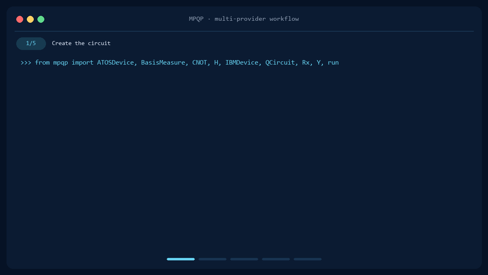

# The MPQP library

MPQP, Multi-Platform Quantum Programming, is a Python library for building
quantum circuits and running them on simulators and quantum hardware from
multiple providers through one consistent API.



On this page, you will find:

1. how to [install](#installation) the library;
2. how to [start using](#usage) it;
3. and the current active [contributors](#contributors).

## Installation

MPQP supports Python 3.10 through 3.13 on Windows, Linux, and macOS. We are 
dependant on the SDKs we support to enable various python versions and OS 
support, for instance, MPQP was validated on Ubuntu LTS 20.04, while Ubuntu 
18.04 is not supported because myQLM does not support it.

The preferred installation method is with the `pipy` repo. Install MPQP with 
its built-in Qiskit Aer simulation support:

```console
pip install mpqp
```

Provider integrations are available as optional extras:

| Provider integration | Install command |
| --- | --- |
| IBM Quantum and IonQ | `pip install "mpqp[qiskit]"` |
| Amazon Braket | `pip install "mpqp[braket]"` |
| Google Cirq | `pip install "mpqp[cirq]"` |
| Azure Quantum | `pip install "mpqp[azure]"` |
| Eviden myQLM/Qaptiva | `pip install "mpqp[myqlm]"` |
| All providers | `pip install "mpqp[all]"` |

Extras can be combined, for example:

```console
pip install "mpqp[braket,cirq]"
```

<details>
<summary><strong>Provider SDK versions</strong></summary>

MPQP currently targets the following primary SDK versions. The linked
requirement files are the source of truth for all transitive dependencies and
Python-version-specific constraints.

| Provider integration | Primary SDK versions | Requirements |
| --- | --- | --- |
| Qiskit | Qiskit 2.3.1, Qiskit Aer 0.17.2, IBM Runtime 0.45.1, IonQ 1.0.2 | [core](requirements.txt), [provider](requirements_providers/qiskit.txt) |
| Amazon Braket | SDK 1.112.1 on Python 3.11+, 1.106.5 on Python 3.10; local simulator 1.32.0 | [provider](requirements_providers/braket.txt) |
| Cirq | 1.6.1 on Python 3.11+, 1.5.0 on Python 3.10 | [provider](requirements_providers/cirq.txt) |
| Azure Quantum | 3.6.1 | [provider](requirements_providers/azure.txt) |
| myQLM/Qaptiva | 1.12.4 | [provider](requirements_providers/myqlm.txt) |

</details>

You can also clone this repo and install from source, for instance if you need
to modify something. In that case, we advise you to have a look at our
[contribution guide](CONTRIBUTING.md).

## Usage

To get started with MPQP, you can create a quantum circuit with a few gates, and
run it against the backend of your choice:

```python
from mpqp import BasisMeasure, CNOT, IBMDevice, QCircuit, X, run

circuit = QCircuit([H(0), H(1), Rx(0,0), CNOT(1,2), Y(2)])
print(circuit)
#      ┌───┐┌───────┐     
# q_0: ┤ H ├┤ Rx(0) ├─────
#      ├───┤└───────┘     
# q_1: ┤ H ├────■─────────
#      └───┘  ┌─┴─┐  ┌───┐
# q_2: ───────┤ X ├──┤ Y ├
#             └───┘  └───┘
print(run(circuit, IBMDevice.AER_SIMULATOR_STATEVETOR))
# Result: IBMDevice, AER_SIMULATOR_STATEVETOR
#   State vector: [0, 0.5j, -0.5j, 0, 0, 0.5j, -0.5j, 0]
#   Probabilities: [0, 0.25, 0.25, 0, 0, 0.25, 0.25, 0]
#   Number of qubits: 3
```

The same circuit can be sent to several installed providers in one call:

```python
from mpqp import AWSDevice, GOOGLEDevice

results = run(
    circuit,
    [
        IBMDevice.AER_SIMULATOR,
        AWSDevice.BRAKET_LOCAL_SIMULATOR,
        GOOGLEDevice.CIRQ_LOCAL_SIMULATOR,
    ],
)
print(results)
```

The second example requires the Braket and Cirq extras. Remote devices use the
same execution interface after their credentials have been configured with
`setup_connections`.

Explore the [documentation](https://mpqpdoc.colibri-quantum.com/) and the
[example notebooks](examples/notebooks) for circuits, observables, noise
models, variational algorithms, and multi-provider execution.

## Contributors

Thanks to everyone who has helped build MPQP ! You can also view the complete
[contribution history](https://github.com/ColibrITD-SAS/mpqp/graphs/contributors).

<table>
<tr>
<td align="center"><a href="https://github.com/Henri-ColibrITD"><br/><sub>Henri de Boutray</sub></a></td>
<td align="center"><a href="https://github.com/hJaffaliColibritd"><br/><sub>Hamza Jaffali</sub></a></td>
<td align="center"><a href="https://github.com/MoHermes"><br/><sub>Muhammad Attallah</sub></a></td>
<td align="center"><a href="https://github.com/JulienCalistoTD"><br/><sub>Julien Calisto</sub></a></td>
<td align="center"><a href="https://github.com/MathieuG-Colibri"><br/><sub>Mathieu Gras</sub></a></td>
</tr>
<tr>
<td align="center"><a href="https://github.com/ThomasB-Colibri"><br/><sub>Thomas Benzino</sub></a></td>
<td align="center"><a href="https://github.com/ah4dev"><br/><sub>Ahmed Bejaoui</sub></a></td>
<td align="center"><a href="https://github.com/aoife-boyle"><br/><sub>Aoife Boyle</sub></a></td>
<td align="center"><a href="https://github.com/nm727"><br/><sub>Nour Mustapha</sub></a></td>
</tr>
</table>
